

 

 

# NodoCha Hojicha
A calm, greenish theme inspired by my favorite character from K-ON Nodoka Manabe. Crafted to match her gentle tone and personality, in dark mode.
> TUI theme and others are moved to [TUI-Cha](https://github.com/ckruu/TUI-Cha)!

[Windhawk Mods](#windhawk-mods) • [App Themes](#apps-themes) • [Misc](#misc) • [Known issues](#known-issues)

### 🖼️ Previews
| Desktop | Others |
|:-------|:-------|
| 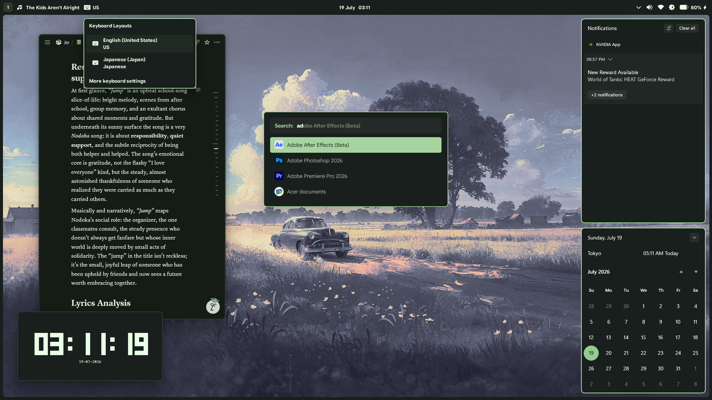 | 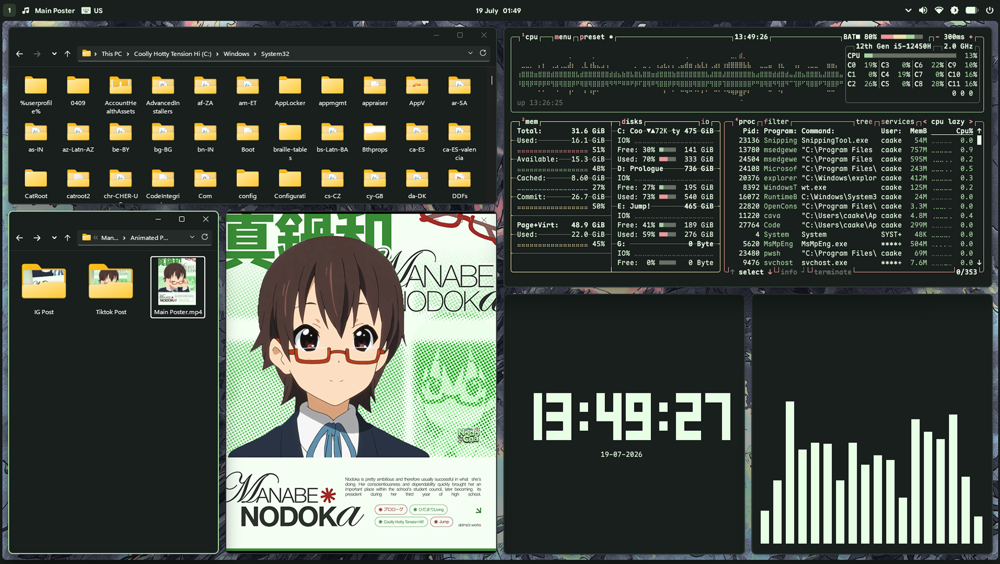 |
| 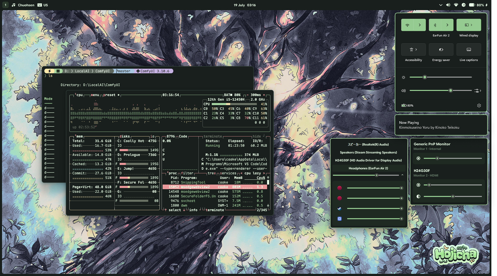 | 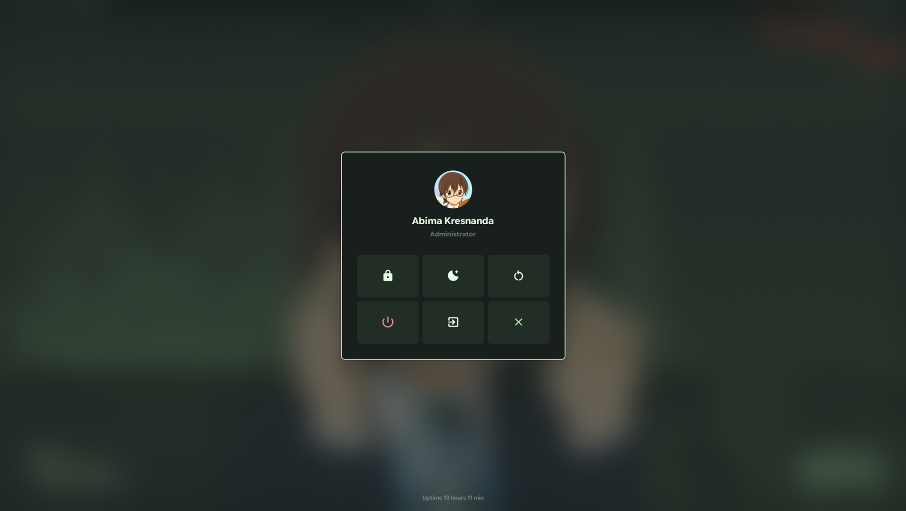 |
| 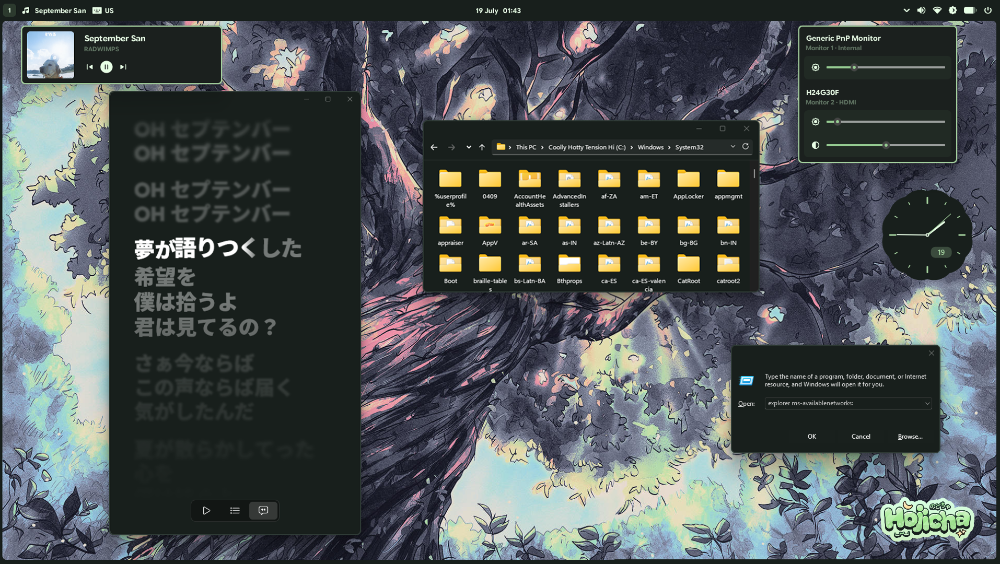 | 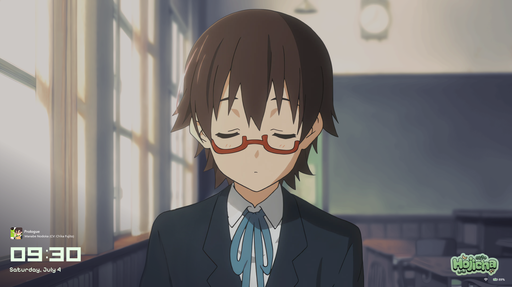 |

> Screenshots are still WIP, some stuff below this part isn't updated yet to reflect the shown screenshot. this message will be deleted in the future.

#### Features
- Matching themes across several apps and system parts
- Reimagined Windows UI
- Fully Keyboard driven
- Clean and simplicity in mind, focusing more on productivity

### 🦅 Windhawk Mods
| Configured |
|:-------|
| Lockscreen Styler [⚙️ Config](./Windhawk/Lockscreen.yml) • [Clock Font](https://www.dafont.com/quinquefive.font) • [Date Font](https://fonts.google.com/specimen/Pixelify+Sans) |
| 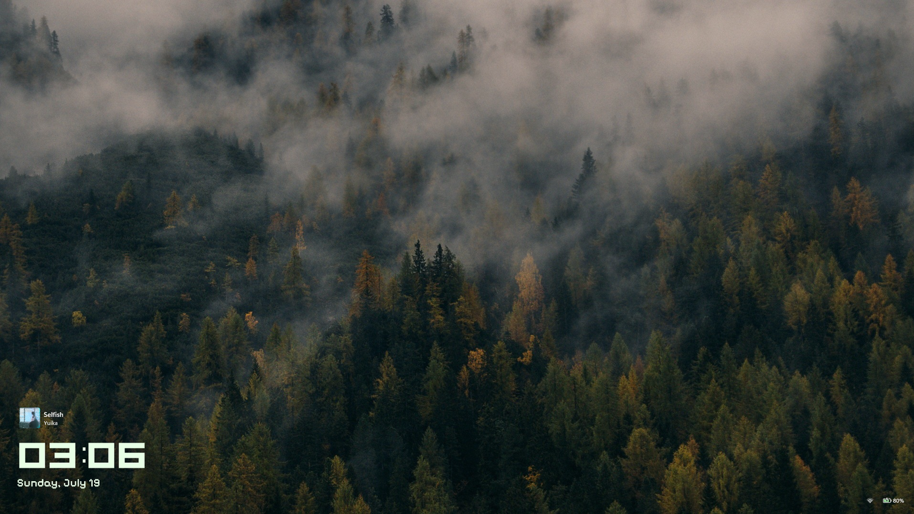 |
| [Notification Styler](https://windhawk.net/mods/windows-11-notification-center-styler) [⚙️ Config](./Windhawk/Notification%20Center.yml) |
| 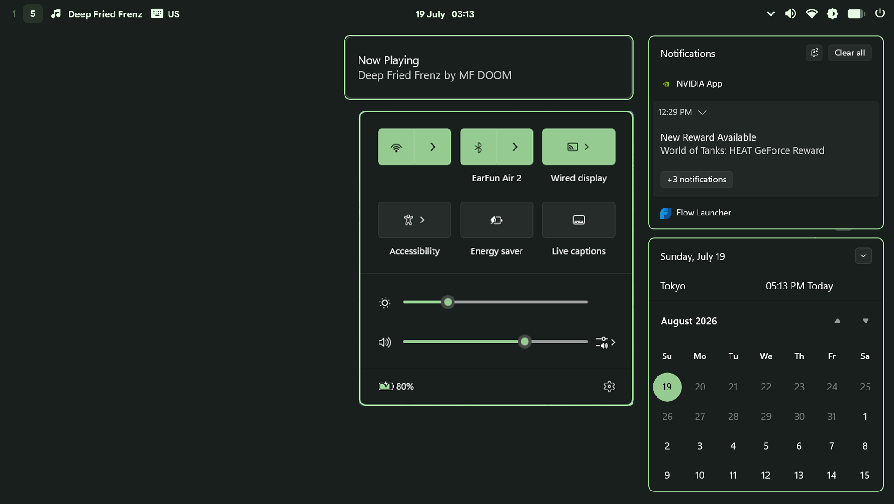 |
| [Taskbar Styler](https://windhawk.net/mods/windows-11-taskbar-styler) [⚙️ Config](./Windhawk/Taskbar%20Styler.yml.yml) |
| 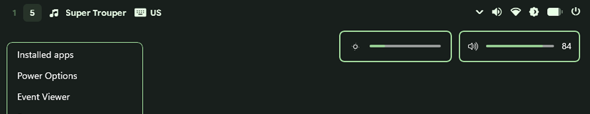 |
| [Translucent Windows](https://windhawk.net/mods/translucent-windows) [⚙️ Config](./Windhawk/Translucent%20Windows.yml) - Set a custom color accross Windows UI & apps that supports it |
| 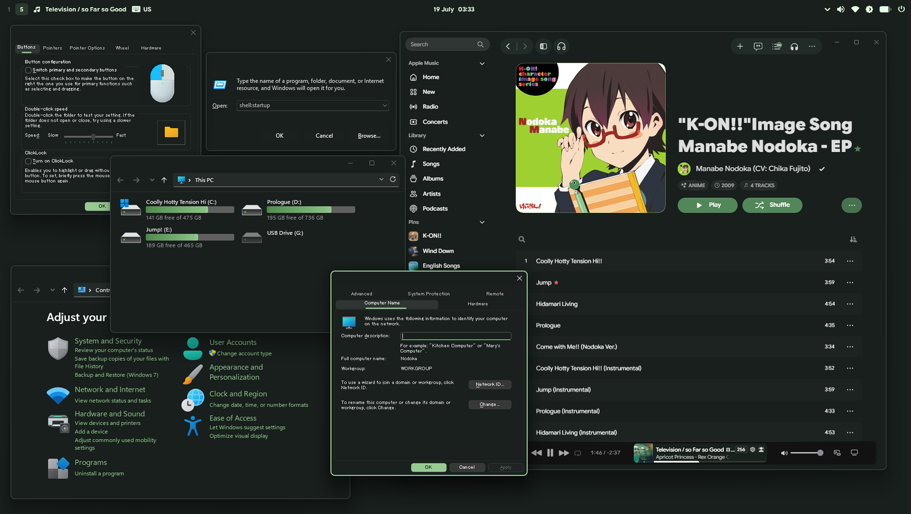 |
| [Customize Windows notifications placement](https://windhawk.net/mods/notifications-placement) [⚙️ Config](./Windhawk/Notification%20Placement.yml) |
| 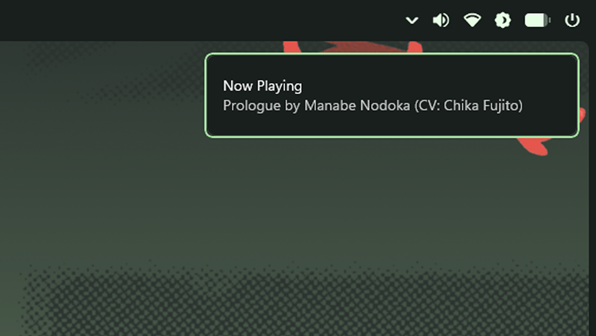 |
| Material You Desktop Widgets 📦 WIP! - Add material you widgets via Windhawk |
| 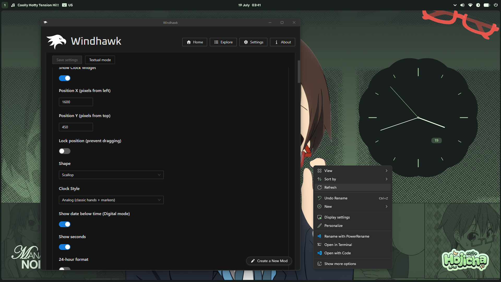 |
| [Taskbar tray system icon tweaks](https://windhawk.net/mods/taskbar-tray-system-icon-tweaks) [⚙️ Config](./Windhawk/Taskbar%20tray.yml) - Removes every tray icon |
| [Taskbar Height & icon size](https://windhawk.net/mods/taskbar-icon-size) [⚙️ Config](./Windhawk/Taskbar%20Height.yml) - Make taskbar invisible |

#### Stock

| Taskbar | Windows Explorer |
| [Block start menu and hosts](https://windhawk.net/mods/block-windows-startmenu-and-hosts) | [Windows 7 Command Bar](https://windhawk.net/mods/win7-command-bar) |
| [Disable Taskbar Thumbnails](https://windhawk.net/mods/taskbar-thumbnails) | [Explorerframe fixes for Win11 22H2+](https://windhawk.net/mods/explorerframe-fixes-for-win11-22h2plus) |
| [Taskbar on top for Windows 11](https://windhawk.net/mods/taskbar-on-top) | [Hide Search Bar](https://windhawk.net/mods/hide-search-bar) | [UXTheme hook](https://windhawk.net/mods/uxtheme-hook) |

| Other |
| [Win32 UI Modernizer](https://discord.com/channels/923944342991818753/1511757700852351006) - By @dangotcrazy on Discord. | [Invisible Window Borders](https://windhawk.net/mods/invisible-borders) |
| [Hide Titlebar Icon and Text](https://windhawk.net/mods/hide-titlebar-elements) | 

### 🖱️ App Themes
#### Main
| [YASB](https://github.com/amnweb/yasb) [⚙️ Config](./Apps/YASB/config.yaml) • [⚙️ Styles](./Apps/YASB/styles.css) • [Material Symbols](https://discord.com/channels/1353495377768218654/1500414078483693598/1504200300142002368) - [Original repo](https://github.com/pixtelslinks/yasb-material-theme) by @pixtelslinks on Discord. [Warning](#️-known-issues) |
| 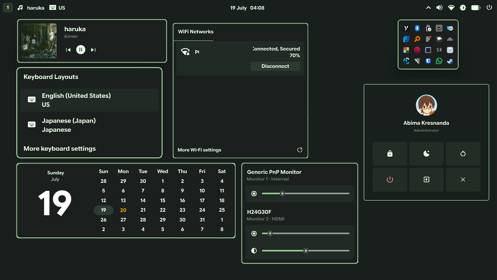 |
| [GlazeWM](https://github.com/glzr-io/glazewm) [⚙️ Config](./Apps/GlazeWM/config.yaml) • This config includes GlazeWM animations, compile [this fork of GlazeWM](https://github.com/florensm/glazewm/tree/feat/animations-pr) to use it. |
| 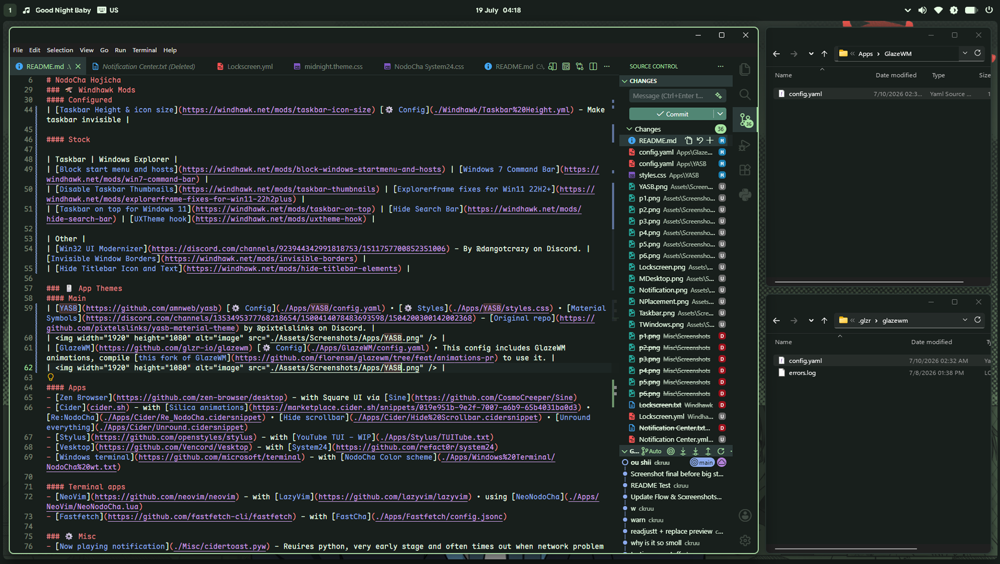 |
| [Flow Launcher](https://www.flowlauncher.com/) 📦 WIP! • [⚙️ With icon config](https://github.com/404) • [⚙️ Without icon config](https://github.com/404) - This config modifies Win11Light XAML to work properly. if you have another theme that uses Win11Light as the base, it might look broken. [Another reminder](###known-issues) |
| 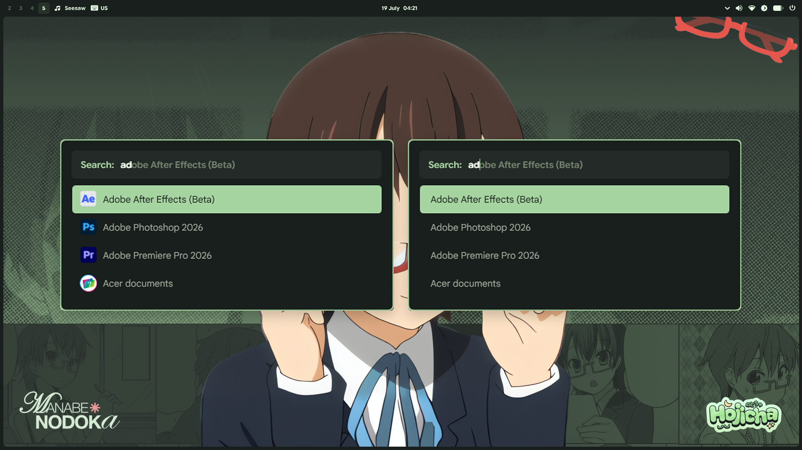 |
| [Tacky Borders](https://github.com/lukeyou05/tacky-borders) [⚙️ Config](./Apps/Tacky-borders/config.yaml) |

#### Apps
| [Vesktop](https://github.com/Vencord/Vesktop) with [⚙️ NodoCord](./Apps/Vesktop/NodoCord.css) • 📦 WIP! [Custom Vesktop Icons](https://github.com/404) |
| 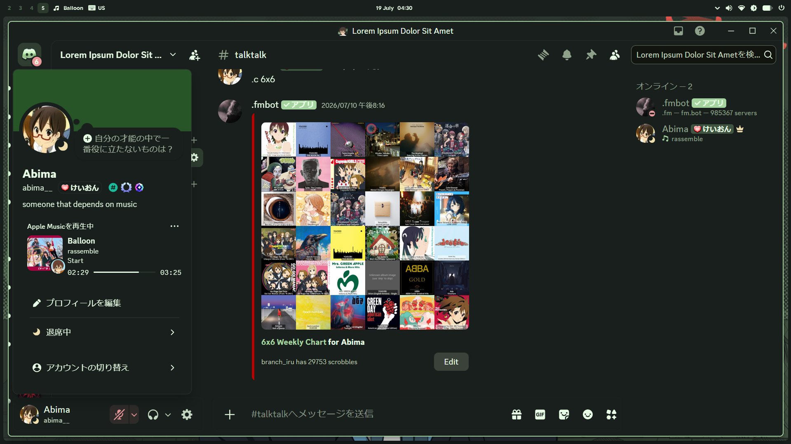 |
| [Zen Browser](https://github.com/zen-browser/desktop) with [⚙️ Transparent Zen](https://zen-browser.app/mods/642854b5-88b4-4c40-b256-e035532109df/) |
| 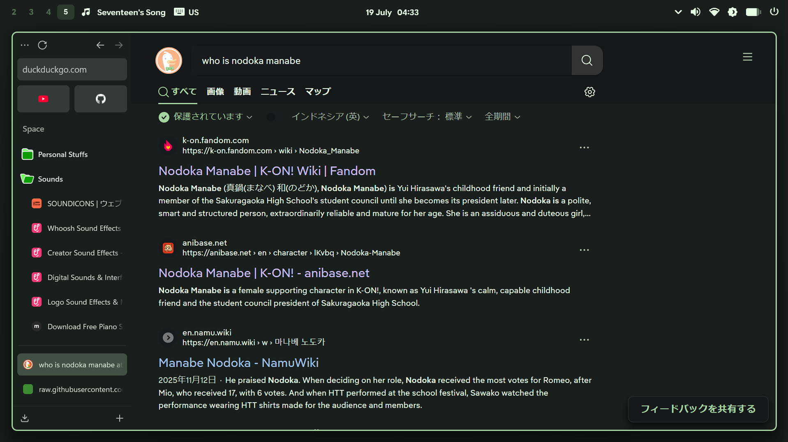 |
| [Cider](cider.sh) - with [⚙️ Silica animations](https://marketplace.cider.sh/snippets/019e951b-9e2f-7007-a6b9-65b4031ba0d3) • [⚙️ Cider 4 NodoCha](./Apps/Cider/Cider_4_NodoCha.cidersnippet) • [⚙️ Hide scrollbar](./Apps/Cider/Hide%20Scrollbars.cidersnippet) • and built-in Remove Glaze |
| 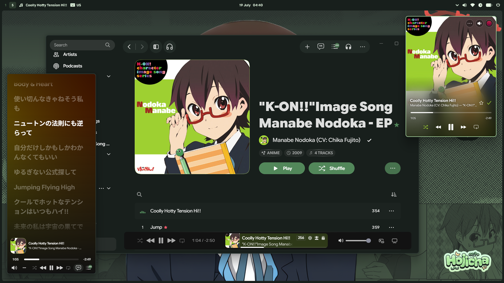 |
| [Windows terminal](https://github.com/microsoft/terminal) with [⚙️ NodoCha Hojicha](./Apps/Windows%20Terminal/NodoCha%20wt.txt) • and [OhMyPosh](https://ohmyposh.dev/) with [⚙️ NodoCha Prompt](./Apps/Windows%20Terminal/OhMyPosh.json) |
| 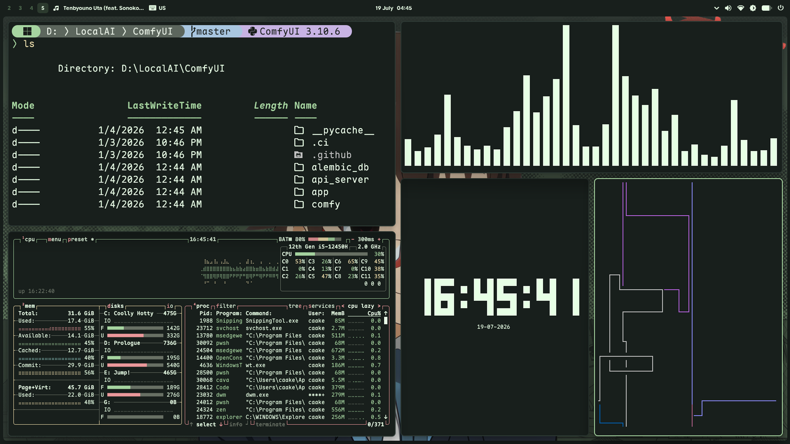 |
| [Stylus](https://github.com/openstyles/stylus) with NodoCha Web [📦 WIP!](https://github.com/404) |

#### Terminal apps
| [NeoVim](https://github.com/neovim/neovim) - with [LazyVim](https://github.com/lazyvim/lazyvim) • using [⚙️ NeoNodoCha](./Apps/NeoVim/NeoNodoCha.lua) - [Fastfetch](https://github.com/fastfetch-cli/fastfetch) - with [⚙️ FastCha](./Apps/Fastfetch/config.jsonc) - [Clock-rs](https://github.com/Oughie/clock-rs) - [cava](https://github.com/karlstav/cava) - [pipes-rs](https://github.com/lhvy/pipes-rs) - [btop](https://github.com/aristocratos/btop) |
| 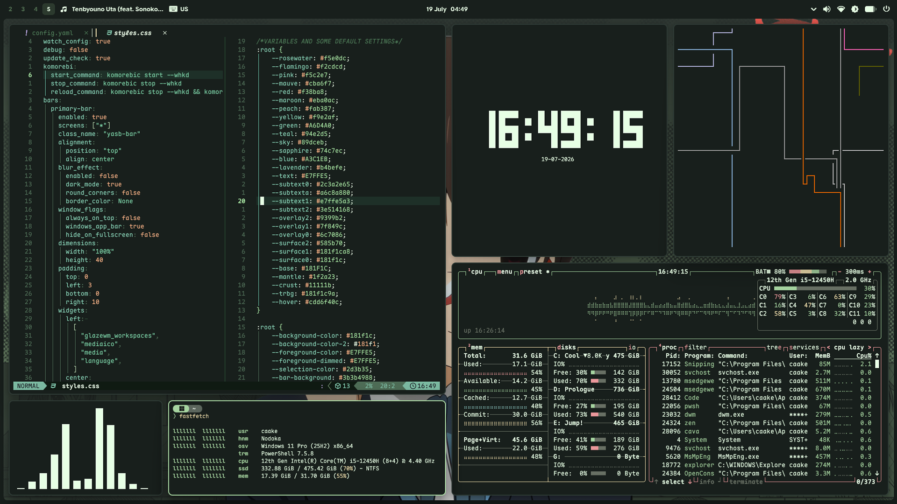 |

### ⚙️ Misc
- [Now playing notification](./Misc/cidertoast.pyw) - Reuires python, very early stage and often times out when network problem occurs or cider closed, only tested with Cider.

### ⚠️ Known Issues
- Desktop/Screen margin is wallpaper based because YASB Doesn't currently support it. If you wish to replicate it, you can use this [Figma template](figma.com) to use it with your own wallpaper, or use the [Pre-made wallpapers](link.to)
- YASB bar is transparent, visibility may vary based on current wallpaper.
- Windows Lockscreen mod can sometimes not start upon boot, this is a known limitation of how windhawk works.
- Only tested with 1080p 16:9 monitors with dual monitor setup. if you use a different resolution than 1080p 16:9 some things will broke.
- Flow launcher theme can break if you update the app. It is recommended to keep update off, or manually fix it every update.