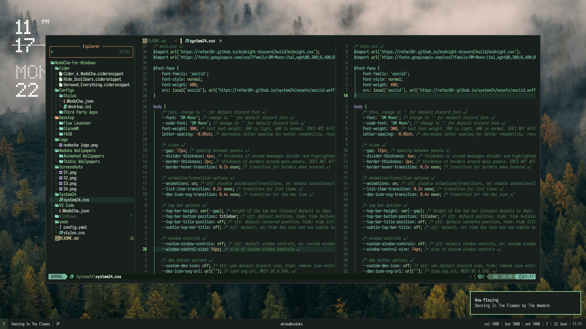
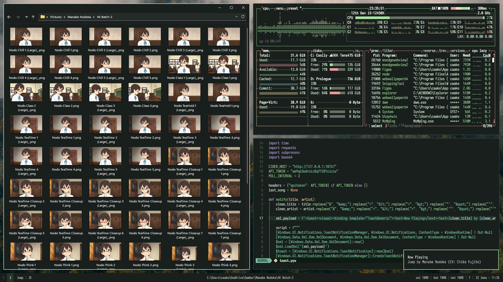
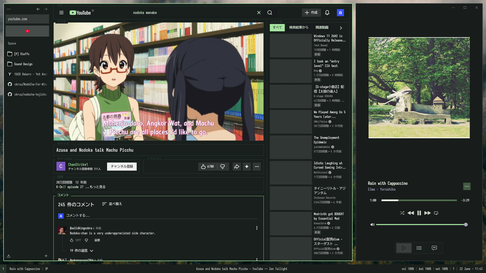
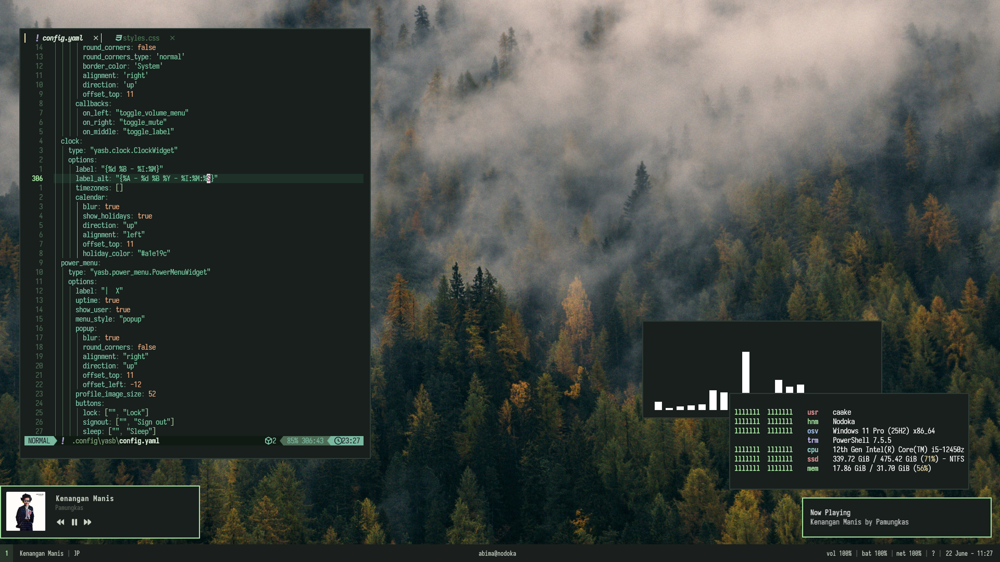
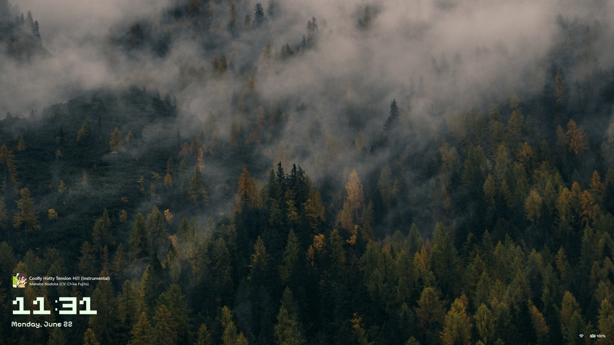
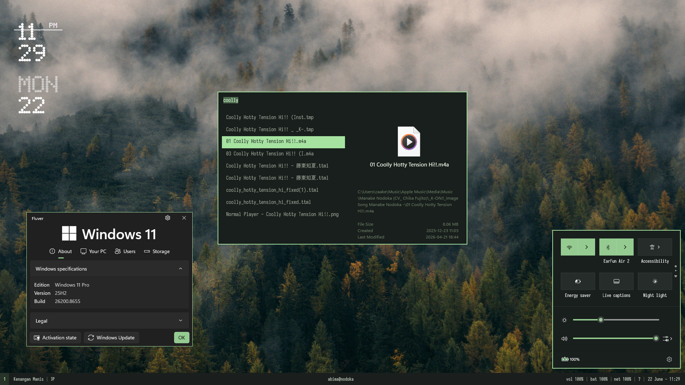

 

 

# NodoCha Hojicha
A calm, greenish theme inspired by my favorite character from K-ON Nodoka Manabe. Crafted to match her gentle tone and personality, in dark mode.

[Preview](#preview) • [Windhawk Mods](#windhawk-mods) • [App Themes](#apps-themes)

###Preview

###Windhawk Mods
####Configured
[Lockscreen](./Windhawk/Lockscreen.txt) • [Taskbar styler](./Windhawk/Taskbar%20Styler.txt) • [Notification Center Styler](./Windhawk/Notification%20Center.txt) • [Translucent Windows](./Windhawk/Translucent%20Windows.txt) • [Taskbar height and icon size](./Windhawk/Taskbar%20Height.txt) • [Taskbar tray system icon tweaks](./Windhawk/Taskbar%20tray.txt)

####Stock mod
[Block start menu and hosts](https://windhawk.net/mods/block-windows-startmenu-and-hosts) • [Disable rounded corners](https://windhawk.net/mods/disable-rounded-corners) • [Disable taskbar thumbnails](https://windhawk.net/mods/taskbar-thumbnails) • [Hide search bar](https://windhawk.net/mods/hide-search-bar) • [Invisible window borders](https://windhawk.net/mods/invisible-borders) • [Windows 7 command bar](https://windhawk.net/mods/win7-command-bar) • [UX theme hook](https://windhawk.net/mods/uxtheme-hook) • [Taskbar tray system icon tweaks](https://windhawk.net/mods/taskbar-tray-system-icon-tweaks) • [Remove command bar](https://windhawk.net/mods/remove-command-bar) • [Hide titlebar icon and text](https://windhawk.net/mods/hide-titlebar-elements)

###App Themes
- [Zen Browser](https://github.com/zen-browser/desktop) - with Square UI via [Sine](https://github.com/CosmoCreeper/Sine)
- [Cider](cider.sh) - with [Silica animations](https://marketplace.cider.sh/snippets/019e951b-9e2f-7007-a6b9-65b4031ba0d3) • [Re:NodoCha](./Apps/Cider/Re_NodoCha.cidersnippet) • [Hide scrollbar](./Apps/Cider/Hide%20Scrollbar.cidersnippet) • [Unround everything](./Apps/Cider/Unround.cidersnippet)
- [NeoVim](https://github.com/neovim/neovim) - with [LazyVim](https://github.com/lazyvim/lazyvim) • using [NeoNodoCha](./Apps/NeoVim/NeoNodoCha.lua)
- [Fastfetch](https://github.com/fastfetch-cli/fastfetch) - with [FastCha](./Apps/Fastfetch/config.jsonc)
- [Stylus](https://github.com/openstyles/stylus) - with [YouTube TUI - WIP](./Apps/Stylus/TUITube.txt)
- [Vesktop](https://github.com/Vencord/Vesktop) - with [System24](https://github.com/refact0r/system24)
- [Windows terminal](https://github.com/microsoft/terminal) - with [NodoCha Color scheme](./Apps/Windows%20Terminal/NodoCha%20wt.txt)